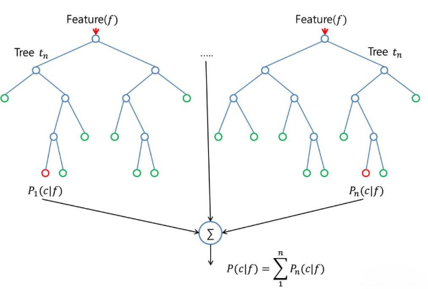
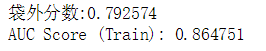
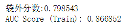

# 天池新人赛 回头客预测之模型训练一 RandomForest随机森林
姓名：朱海波            
学号：16051336

---

## 第一部分---RandomForest随机森林模型基本介绍
鉴于决策树容易过拟合的缺点，随机森林采用多个决策树的投票机制来改善决策树。随机森林的本体就是决策树。随机森林本质上就是多生成几棵决策树，然后众多决策树对预测结果进行投票，决定最后的分类结果。

    

决策树（`Decision tree`）是机器学习最基本的模型，是一个预测模型；它代表的是对象属性与对象值之间的一种映射关系。树中每个节点表示某个对象，而每个分叉路径则代表某个可能的属性值，而每个叶节点则对应从根节点到该叶节点所经历的路径所表示的对象的值。决策树仅有单一输出，若欲有复数输出，可以建立独立的决策树以处理不同输出。

一个决策树包含三种类型的节点：
* 决策节点：通常用矩形框来表示          
* 机会节点：通常用圆圈来表示            
* 终结点：通常用三角形来表示

决策树的优点：
* 决策树易于理解和实现.人们在通过解释后都有能力去理解决策树所表达的意义。
* 对于决策树，数据的准备往往是简单或者是不必要的.其他的技术往往要求先把数据一般化，比如去掉多余的或者空白的属性。
* 能够同时处理数据型和常规型属性。其他的技术往往要求数据属性的单一。
* 是一个白盒模型如果给定一个观察的模型，那么根据所产生的决策树很容易推出相应的逻辑表达式。
* 易于通过静态测试来对模型进行评测。表示有可能测量该模型的可信度。
* 在相对短的时间内能够对大型数据源做出可行且效果良好的结果。

决策树的缺点：
* 对于那些各类别样本数量不一致的数据，在决策树当中信息增益的结果偏向于那些具有更多数值的特征。
---
随机森林（`RF`, `RandomForest`）包含多个决策树的分类器，并且其输出的类别是由个别树输出的类别的众数而定。通过自助法（`boot-strap`）重采样技术，不断生成训练样本和测试样本，由训练样本生成多个分类树组成的随机森林，测试数据的分类结果按分类树投票多少形成的分数而定。

随机森林以随机的方式建立一个森林，森林里有很多决策树，且每棵树之间无关联，当有一个新样本进入后，让森林中每棵决策树分别各自独立判断，看这个样本应该属于哪一类（对于分类算法）。然后看哪一类被选择最多，就选择预测此样本为那一类。           
    

优点：

* 1.在当前的很多数据集上，相对其他算法有着很大的优势，表现良好。
* 2.它能够处理很高维度（feature很多）的数据，并且不用做特征选择。PS：特征子集是随机选择的。
* 3.在训练完后，它能够给出哪些feature比较重要。
* 4.在创建随机森林的时候，对generlization error使用的是无偏估计，模型泛化能力强。
* 5.训练速度快，容易做成并行化方法。PS：训练时树与树之间是相互独立的。
* 6.在训练过程中，能够检测到feature间的互相影响
* 7.实现比较简单
* 8.对于不平衡的数据集来说，它可以平衡误差。
* 9.如果有很大一部分的特征遗失，仍可以维持准确度。

随机森林还有一个重要的优点就是，没有必要对它进行交叉验证或者用一个独立的测试集来获得误差的一个无偏估计。它可以在内部进行评估，也就是说在生成的过程中就可以对误差建立一个无偏估计。

缺点：
* 1.在噪音较大的分类或回归问题上会出现过拟合现象。
* 2.对于不同级别属性的数据，级别划分较多的属性会对随机森林有较大影响，则RF在这种数据上产出的数值是不可信的。

随机森林的生成方法：
* 1.从样本集中通过重采样的方式产生n个样本。
* 2.假设样本特征数目为a，对n个样本选择a中的k个特征，用建立决策树的方式获得最佳分割点。
* 3.重复m次，产生m棵决策树。
* 4.多数投票机制来进行预测。   

（需要注意的一点是，这里m是指循环的次数，n是指样本的数目，n个样本构成训练的样本集，而m次循环中又会产生m个这样的样本集）

---
## 第二部分---RandomForest随机森林模型参数
只有了解参数的作用才能开始对模型训练进行调试。

| 参数           | 定义及作用                                 |
| -------------: | ----------------------------------------- |
| `n_estimators` | int，optional（默认 = 10）森林里的树木数量。|
| `criterion` | string，optional（默认 = “gini”）衡量分裂质量的功能。支持的标准是基尼杂质的“`gini`”和信息增益的“熵”。注意：此参数是特定于树的。|
| `max_depth` | int 或 None，optional（默认 = 无）树的最大深度。如果为None，则扩展节点直到所有叶子都是纯的或直到所有叶子包含少于`min_samples_split`样本。|
| `min_samples_split` | int，float，optional（默认 = 2）拆分内部节点所需的最小样本数。|
| `min_samples_leaf` | int，float，optional（默认 = 1）叶子节点所需的最小样本数。|
| `min_weight_fraction_leaf` | float，optional（默认 = 0）需要在叶节点处的权重总和（所有输入样本）的最小加权分数。|
| `max_features` | int，float，string 或 None，optional（默认 = “auto”）寻找最佳分割时要考虑的功能数量。|
| `max_leaf_nodes` | int 或 None，optional（默认 = None）`max_leaf_nodes`以最好的方式种植树木。最佳节点定义为杂质的相对减少。如果None则无限数量的叶节点。|
| `min_impurity_decrease` | float，optional（默认= 0）如果该分裂导致杂质的减少大于或等于该值，则将分裂节点。|
| `min_impurity_split` | float，（默认 = 1e-7）树木生长早期停止的门槛。如果节点的杂质高于阈值，节点将分裂，否则它是叶子。|
| `bootstrap` | boolean，optional（默认 = True）是否在构建树时使用`bootstrap`样本。|
| `oob_score` | bool（默认= False）是否使用袋外样品来估计泛化精度。|
| `n_jobs` | int 或 None，optional（默认 = None）适合和预测并行运行的作业数。|
| `random_state` | int，RandomState instance 或 None，optional（默认 = None）|
| `verbose` | int，optional（默认值 = 0）在拟合和预测时控制详细程度。|
| `warm_start` | bool，optional（默认 = False）设置True为时，重用上一个调用的解决方案以适合并向整体添加更多估算器，否则，只需适合整个新林。|
| `class_weight` | dict，list of dicts，“balanced”，“balanced_subsample” 或None，optional（默认 = None）|

更加详细的参数请阅读《[官方文档](https://scikit-learn.org/stable/modules/generated/sklearn.ensemble.RandomForestClassifier.html)》

---

RF框架参数详解：
* 1) `n_estimators`: 也就是弱学习器的最大迭代次数，或者说最大的弱学习器的个数。一般来说`n_estimators`太小，容易欠拟合，`n_estimators`太大，计算量会太大，并且`n_estimators`到一定的数量后，再增大`n_estimators`获得的模型提升会很小，所以一般选择一个适中的数值。默认是100。
* 2) `oob_score` :即是否采用袋外样本来评估模型的好坏。默认是`False`。个人推荐设置为`True`，因为袋外分数反应了一个模型拟合后的泛化能力。
* 3) `criterion`: 即`CART`树做划分时对特征的评价标准。分类模型和回归模型的损失函数是不一样的。分类RF对应的`CART`分类树默认是基尼系数`gini`,另一个可选择的标准是信息增益。回归`RF`对应的`CART`回归树默认是均方差`mse`，另一个可以选择的标准是绝对值差`mae`。一般来说选择默认的标准就已经很好的。

从上面可以看出， `RF`重要的框架参数比较少，主要需要关注的是 `n_estimators`，即`RF`最大的决策树个数。

RF决策树参数详解：
* 1) `RF`划分时考虑的最大特征数`max_features`: 可以使用很多种类型的值，默认是"`auto`",意味着划分时最多考虑`√N`个特征；如果是"`log2`"意味着划分时最多考虑`log2N`个特征；如果是"`sqrt`"或者"`auto`"意味着划分时最多考虑`√N`个特征。如果是整数，代表考虑的特征绝对数。如果是浮点数，代表考虑特征百分比，即考虑（百分比* `N`）取整后的特征数。其中`N`为样本总特征数。一般我们用默认的"`auto`"就可以了，如果特征数非常多，我们可以灵活使用刚才描述的其他取值来控制划分时考虑的最大特征数，以控制决策树的生成时间。
* 2) 决策树最大深度`max_depth`: 默认可以不输入，如果不输入的话，决策树在建立子树的时候不会限制子树的深度。一般来说，数据少或者特征少的时候可以不管这个值。如果模型样本量多，特征也多的情况下，推荐限制这个最大深度，具体的取值取决于数据的分布。常用的可以取值10-100之间。
* 3) 内部节点再划分所需最小样本数`min_samples_split`: 这个值限制了子树继续划分的条件，如果某节点的样本数少于`min_samples_split`，则不会继续再尝试选择最优特征来进行划分。 默认是2。如果样本量不大，不需要管这个值。如果样本量数量级非常大，则推荐增大这个值。
* 4) 叶子节点最少样本数`min_samples_leaf`: 这个值限制了叶子节点最少的样本数，如果某叶子节点数目小于样本数，则会和兄弟节点一起被剪枝。 默认是1,可以输入最少的样本数的整数，或者最少样本数占样本总数的百分比。如果样本量不大，不需要管这个值。如果样本量数量级非常大，则推荐增大这个值。
* 5) 叶子节点最小的样本权重和`min_weight_fraction_leaf`：这个值限制了叶子节点所有样本权重和的最小值，如果小于这个值，则会和兄弟节点一起被剪枝。 默认是0，就是不考虑权重问题。一般来说，如果我们有较多样本有缺失值，或者分类树样本的分布类别偏差很大，就会引入样本权重，这时我们就要注意这个值了。
* 6) 最大叶子节点数`max_leaf_nodes`: 通过限制最大叶子节点数，可以防止过拟合，默认是"`None`”，即不限制最大的叶子节点数。如果加了限制，算法会建立在最大叶子节点数内最优的决策树。如果特征不多，可以不考虑这个值，但是如果特征分成多的话，可以加以限制，具体的值可以通过交叉验证得到。
* 7) 节点划分最小不纯度`min_impurity_split`:  这个值限制了决策树的增长，如果某节点的不纯度(基于基尼系数，均方差)小于这个阈值，则该节点不再生成子节点。即为叶子节点 。一般不推荐改动默认值`1e-7`。

上面决策树参数中最重要的包括最大特征数`max_features`， 最大深度`max_depth`， 内部节点再划分所需最小样本数`min_samples_split`和叶子节点最少样本数`min_samples_leaf`。

RF框架参数和RF决策树参数的详细解释参考自博客《[scikit-learn随机森林调参小结](https://www.cnblogs.com/pinard/p/6160412.html)》

---
我在调整了模型的各种参数之后，还是没有明显的体会到那种模型训练的等待感，我的电脑的配置也不高，整个训练数据集也不小，但是整个模型的训练的时间还是很快，大约在5min左右就能得出训练的结果。我觉得有很大一部分原因是我控制了森林中树的数量。于是我将 `n_estimators`的值从最初的100调到了1000，从1000调到了10000，然后发现预测精度上升，但是没有预期中的那么明显。

随机森林中的参数要么是为了增加模型的预测能力，要么是为了更容易训练模型。
* 1.更好地预测模型的特征：
  *  `max_features`：增加`max_features`通常可以提高模型的性能，因为现在每个节点都有更多的选项需要考虑。然而，这并不一定正确，因为这会降低作为随机森林的`USP`的单个树的多样性。但是，当然，可以通过增加`max_features`来降低算法的速度。因此，需要达到正确的平衡并选择最佳的`max_features`。
  *  `n_estimators`：这是在进行最大投票或预测平均值之前要构建的树的数量。更多的树可以提供更好的性能，但会使代码变慢。应该选择处理器可以处理的高值，因为这会使预测更强大，更稳定。
  *  `min_sample_leaf`：如果之前已经构建了决策树，则可以了解最小样本叶大小的重要性。Leaf是决策树的结束节点。较小的叶片使模型更容易捕获列车数据中的噪声。应该尝试多种叶片大小以找到最适合您的用例。

* 2.使模型训练更容易的特点：           
有一些属性会直接影响模型训练速度。以下是可以调整模型速度的关键参数：
  *  `n_jobs`：此参数告诉引擎允许使用多少处理器。值“-1”表示没有限制，而值“1”表示它只能使用一个处理器。
  *  `random_state`：此参数使解决方案易于复制。如果给出相同的参数和训练数据，`random_state`的确定值将始终产生相同的结果。
  *  `oob_score`：这是一种随机森林交叉验证方法。这与保留一种验证技术非常相似，但是，速度要快得多。该方法仅标记在不同发束中使用的每个观察。然后它只根据没有使用这个特定观察来训练自己的树木，找出每个观察的最大投票得分。由于随机决策树生成过程采用的Boostrap，所以在一棵树的生成过程并不会使用所有的样本，未使用的样本就叫（Out_of_bag）袋外样本，通过袋外样本，可以评估这个树的准确度，其他子树叶按这个原理评估，最后可以取平均值，即是随机森林算法的性能；这是随机森林一个重要的优点，没有必要对随机森林进行交叉验证或者用一个独立的测试集来获得误差的一个无偏估计。随机森林可以在内部进行评估，也就是说在生成的过程中就可以对误差建立一个无偏估计。

增加模型的预测能力且使训练模型变得容易参考自《[Tuning the parameters of your Random Forest model](https://www.analyticsvidhya.com/blog/2015/06/tuning-random-forest-model/)》

---

## 第三部分---RandomForest随机森林模型的调用
`RandomForest`随机森林模型的代码:

```
from sklearn.model_selection import cross_val_score
from sklearn.model_selection import StratifiedKFold
from sklearn.ensemble import RandomForestClassifier
from sklearn.metrics import confusion_matrix
from sklearn.model_selection import train_test_split
from sklearn import  metrics  
import pandas as pd
import numpy as np
#以上，导入所需要的库

#为导出预测数据做准备
test = pd.read_csv("DataSet/format2/test.csv", sep=',')  
test_for_output = test[test.label != -1.0]

#为X，y做准备
training = pd.read_pickle('DataSet/train.pkl')
testing = pd.read_pickle('DataSet/test.pkl')

#训练数据的X，y
X = training.drop(columns = ['label']).values
y = training.label.values

#测试数据的X
X_test = testing.values

#RF随机森林的参数
rf0 = RandomForestClassifier(n_estimators=10000, #森林中树木的数量
                             random_state = 18, #随机数生成器使用的种子
                             class_weight='balanced',#使用y的值自动调整与输入数据中的类频率成反比的权重 
                             n_jobs=-1,#-1表示使用所有处理器
                             #max_features='sqrt',#最大特征数
                             max_features= 10,#最大特征数
                             min_samples_leaf = 40,#叶子节点所需的最小样本数
                             oob_score = True,#使用袋外分数
                             max_depth=None)#为None，扩展节点直到所有叶子都是纯的或直到所有叶子包含少于min_samples_split样本

#从训练集（X，y）建立一片树林，也就是建立随机森林
rf0.fit(X, y)

#输出袋外分数
print("袋外分数:%f" % rf0.oob_score_)

#预测train概率
y_predprob = rf0.predict_proba(X)[:,1]
print("AUC Score (Train): %f" % metrics.roc_auc_score(y, y_predprob))

#预测test概率
predict_label_test = rf0.predict_proba(X_test)[:,1] 

#将预测的结果写入测试集
result = pd.DataFrame({'user_id':test_for_output['user_id'].as_matrix(), 
                        'merchant_id':test_for_output['merchant_id'].as_matrix(), 
                        'prob':predict_label_test.astype(np.float32)},
                      columns=['user_id','merchant_id','prob'])

#导出预测结果                      
result.to_csv("C:/Users/zero/Desktop/prediction.csv", index = False)
```

代码运行结果：  
这是100颗树时的结果：    


这是1000颗树时的结果：    


这是10000颗树时的结果：   


前面两次的训练时间几乎可以忽略不计，最后一次训练时间为1小时36分钟。虽然树的颗树增加了很多，但是预测的结果几乎没有多大的变化。

临近期末，由于时间的匆忙和项目整体进度比较慢，提交到天池上的预测数据结果用的是最初使用100颗树进行训练的结果。之后也没有再进行数据的提交，因此究竟树的颗数的增加对模型训练结果的影响是正影响还是负影响目前不得而知。这项工作预计将在寒假中完善。

从我们12-29提交的预测数据来看，对于第一次做数据预测项目来说，这个结果已经很不错了。    
我们队伍的准确度是:0.676352。      
在2121各参赛队伍中，我们的排名是在第71位。     


但是相比于第一名 阿里云官方 的准确度为 0.704954。我们还有很大的提升空间。

---

## 第四部分---RandomForest随机森林模型个人总结
先说说自己在RandomForest随机森林模型时遇到的问题，在处理完特征工程之后，有一些特征存在缺失值，然后jupyter提示报错`ValueError: Input contains NaN, infinity or a value too large for dtype('float64')`,这个问题在我补充完缺失值后解决了。但是我的组员使用`Light GBM`模型就没有这个问题，`Light GBM`模型对缺失值可以自动处理。

这里我也写一下我个人处理这个报错的方法：
* 1、检查数据中是否有缺失值(`NaN`)        
使用`np.isnan(train).any()`，    
若结果为：
  * `Flase`：表示对应特征的特征值中无缺失值
  * `True`：表示有缺失值
* 2、删除有缺失值的行       
`train.dropna(inplace=True)`           
* 3、然后在看数据中是否有缺失值，也可以根据需要对缺失值进行填充处理：         
`train.fillna('0')`

我选择的是对缺失值进行填充，我的总共样本数是260844条，其中有缺失值的样本是80条，基本上可以忽略不计，但是我也不想删去这一部分数据。虽然直接将缺失值进行删除我认为对预测结果的影响也不会太大。

关于缺失值的填充，其实也是很有学问的。对于存在大部分缺失数据的预测数据集来说，选择好的缺失值填充方法就显得尤为重要。不过缺失值填充不属于这篇文章的范畴，这里我也就不再赘述。详情见
[MissingValueProcessing](https://gitlab.com/liolok/Repeat-Buyers-Prediction/blob/master/docs/MissingValueProcessing.md)

至于这个报错中的`infinity or a value too large for dtype('float64')`问题我没有遇到，这里也不再赘述解决方法。我的总共样本数是260844条，其中有缺失值的样本是80条，基本上可以忽略不计，所以我直接采用`.fillna(0)`函数来对缺失值进行填充，即用`0`来填充
缺失值。

模型训练只是整个预测项目的的一小部分，但是也是整个预测项目关键的一部分，好的模型可以适当的弥补特征工程上的不足。模型的参数是模型最关键的，参数的选择是很重要的，选择适当的参数不仅可以提高模型的精准度，也能减少模型的训练时间，提高模型的训练效率。

不同的模型对数据的预测结果也是不同的，我认为十分有必要使用其他的模型对数据进行预测，然后将各个模型的预测结果进行比较，选出在相同的特征工程下，精确度最高的模型，优化整个项目的成果。不过这些都是后话了，都还没有付诸实施。天池回头客预测新人赛第一赛季的截止日期为2019/03/01，还有近两个月的时间，寒假里再进行对RandomForest随机森林模型的优化和其他模型的学习使用。

2019-01-04-00:54