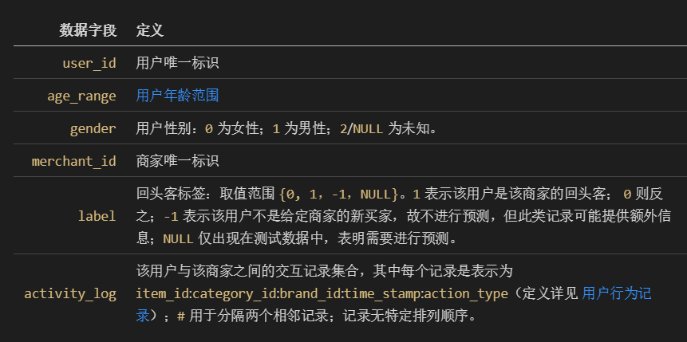
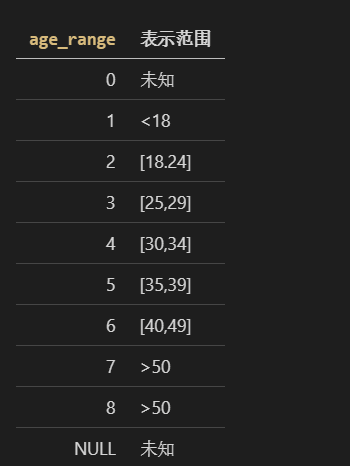
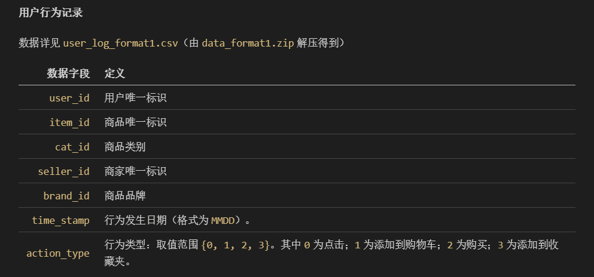
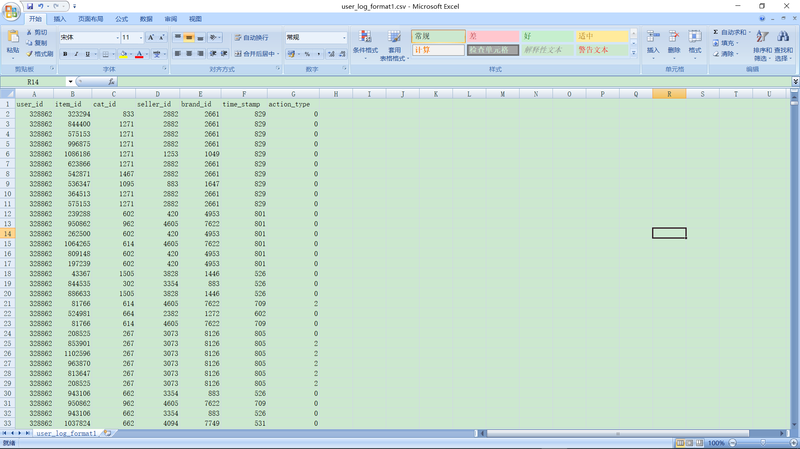
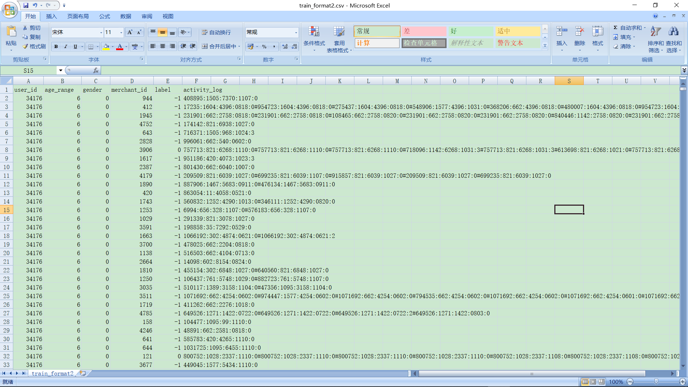

# 第一周工作记录
1.确定本学期创兴实践课题（天池数据挖掘，天猫回头客预测）。 
2.对课题资源进行下载整理。 
3.对课题要求和信息进行翻译和整理（github，md）。 
4.具体如何实践进行探讨。 
5.疑问： 
用户的年龄分段，7、8两段重复。没有意义。 
用户性别，2和NULL表示相同的意思，感觉可以删去一种表示方式。 
时间：2018-09-25 

# 上课老师建议
1.看书，从基本的开始学，不要一下子去看文档和论文，首先要对数据挖掘有一个认识。 
所以我打算先总结一下数据挖掘的基本知识内容。写一篇文章到github。预计完成时间国庆放假第二天晚21：00。（） 
时间：2018-09-26 

# 第二次上课 工作记录
## 1.学习数据挖掘 
[数据挖掘学习](https://github.com/zeronow/data-mining-learning/blob/master/learning.md "鼠标悬浮提示")
## 2.计划项目进程安排
数据预处理，去除冗余
## 3.思考数据 
### 比如说：数据字段定义中 
 
这里的用户性别字段“`gener`”字段中的“`2/NULL`”表示未知性别，我觉得进行数据预处理，定义为“`2`”表示未知性别。 
"`lable`"的“`-1`”值，我觉得意义不大。 

### 再比如说：年龄范围定义字段中 
 
“`age_range`”的"`7`"和“`8`”两个值都表示年龄“`>50`”的人群，我觉得可以统一用“`7`”来表示年龄“`>50`”的人群。 
减少数据冗余。（冗余原因：属性值的重复）

### 用户行为与是否成为回头客的关系
 
"`cat_id`":回头客和商品类别的关系。 
"`brand_id`":回头客和商品品牌的关系。 
"`action_type`":回头客和用户行为的关系。 
2018-10-10

# 第三次上课 工作记录
学习数据挖掘的方法。 
[数据挖掘学习](https://github.com/zeronow/data-mining-learning/blob/master/learning.md "鼠标悬浮提示") 
2018-10-17

# 第四次上课 工作记录
## 上周说要分析数据行为
### 1.肉眼观察
 
用户行为记录各项数据的分析

| 数据字段      | 定义                                                                                                     |
| ------------: | -------------------------------------------------------------------------------------------------------- |
| `user_id`     | 用户唯一标识                                                                                             |
| `item_id`     | 商品唯一标识                                                                                             |
| `cat_id`      | 商品类别                                                                                                 |
| `seller_id`   | 商家唯一标识                                                                                             |
| `brand_id`    | 商品品牌                                                                                                 |
| `time_stamp`  | 行为发生日期（格式为 `MMDD`）。                                                                          |
| `action_type` | 行为类型：取值范围 `{0, 1, 2, 3}`。其中 `0` 为点击；`1` 为添加到购物车；`2` 为购买；`3` 为添加到收藏夹。 |

 

"`cat_id`":回头客和商品类别的关系。 
这个项目的工作是预测，未来6个月的顾客成为回头客的概率。抛开商品的质量好坏和一次性购买数量等因素不谈，商品的类别或者说商品使用时间决定了顾客再次购买的频率。食品、手机。 
分析"`label`"与"`activity_log`"中的第二个数据的关系。 
第一条数据示例 
34176,6,0,944,-1,408895:1505:7370:1107:0 
XXX,XXX,XXX,XXX,label,XXX:cat_id:XXX:XXX:XXX 
确定label值和cat_id值来发现规律 

“`seller_id` ”：回头客和商家的关系。 

"`brand_id`":回头客和商品品牌的关系。 

"`action_type`":回头客和用户行为的关系。 

每一个用户都不同，每一个用户都有自己的购物行为。

### 2.数据计算分析
2018-10-23

