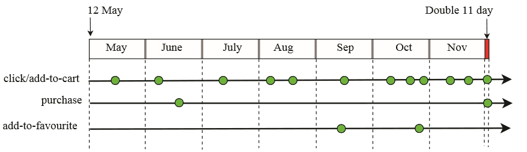

# 第一周工作记录
1.确定本学期创兴实践课题（天池数据挖掘，天猫回头客预测）。 
2.对课题资源进行下载整理。 
3.对课题要求和信息进行翻译和整理（github，md）。 
4.具体如何实践进行探讨。 
5.疑问： 
用户的年龄分段，7、8两段重复。没有意义。 
用户性别，2和NULL表示相同的意思，感觉可以删去一种表示方式。 
时间：2018-09-25 

# 上课老师建议
1.看书，从基本的开始学，不要一下子去看文档和论文，首先要对数据挖掘有一个认识。 
所以我打算先总结一下数据挖掘的基本知识内容。写一篇文章到github。预计完成时间国庆放假第二天晚21：00。（） 
时间：2018-09-26 

# 第二次上课 工作记录
## 1.学习数据挖掘 
[数据挖掘学习](https://github.com/zeronow/data-mining-learning/blob/master/learning.md "鼠标悬浮提示")
## 2.计划项目进程安排
数据预处理，去除冗余
## 3.思考数据 
### 比如说：数据字段定义中 
 
这里的用户性别字段“`gener`”字段中的“`2/NULL`”表示未知性别，我觉得进行数据预处理，定义为“`2`”表示未知性别。 
"`lable`"的“`-1`”值，我觉得意义不大。 

### 再比如说：年龄范围定义字段中 
 
“`age_range`”的"`7`"和“`8`”两个值都表示年龄“`>50`”的人群，我觉得可以统一用“`7`”来表示年龄“`>50`”的人群。 
减少数据冗余。（冗余原因：属性值的重复）

### 用户行为与是否成为回头客的关系
 
"`cat_id`":回头客和商品类别的关系。 
"`brand_id`":回头客和商品品牌的关系。 
"`action_type`":回头客和用户行为的关系。 
2018-10-10

# 第三次上课 工作记录
学习数据挖掘的方法。 
[数据挖掘学习](https://github.com/zeronow/data-mining-learning/blob/master/learning.md "鼠标悬浮提示") 
2018-10-17

# 第四次上课 工作记录
## 上周说要分析数据行为
### 1.数据计算分析
#### 数据挖掘的方法（七）
##### 回归分析方法（函数）

被广泛地用于解释市场占有率、销售额、品牌偏好及市场营销效果。它可以应用到市场营销的各个方面，如客户寻求、保持和预防客户流失活动、产品生命周期分析、销售趋势预测及有针对性的促销活动等。 
主要表现 
(1) 判别自变量是否能解释因变量的显著变化----关系是否存在。 
(2) 判别自变量能够在多大程度上解释因变量----关系的强度。 
(3) 判别关系的结构或形式----反映因变量和自变量之间相关的数学表达式。 
(4) 预测自变量的值。 
(5) 当评价一个特殊变量或一组变量对因变量的贡献时，对其自变量进行控制。 

##### 聚类

顾名思义就是按照相似性和差异性，把一组对象划分成若干类，并且每个类里面对象之间的相似度较高，不同类里面对象之间相似度较低或差异明显。与分类不同的是聚类不依靠给定的类别对对象进行划分。  
分析算法分类 
（1）划分方法 
（2）层次的方法 
（3）基于密度的方法 
（4）基于网格的方法 
（5）基于模型的方法 
它可以应用到客户群体的分类、客户背景分析、客户购买趋势预测、市场的细分等。如谁经常光顾商店，谁买什么东西，买多少？按忠诚卡记录的光临次数、光临时间、年龄、职业等等；还有银行信用卡的黄金客户，按储蓄额、刷卡消费金额和诚信度等。  

##### 关联规则（联系）

是描述数据库中数据项之间所存在的关系的规则，可以从一件事情的发生，来推测另外一件事情的发生，即隐藏在数据间的关联或相互关系，从而更好地了解和掌握事物的发展规律等等。 
关联规则数据挖掘中最经典的案例就是沃尔玛的啤酒和尿布的故事。在美国，一些年轻的父亲下班后经常要到超市去买婴儿尿布，而他们中有30%～40%的人同时也为自己买一些啤酒。于是沃尔玛将啤酒与尿布一起销售，**提高了销售额。 
关联规则的实际应用包括：交叉销售、邮购目录的设计、商品摆放、流失客户分析、基于购买模式进行客户区隔等等…… 
在客户关系管理中，通过对企业的客户数据库里的大量数据进行挖掘，可以从大量的记录中发现有趣的关联关系，找出影响市场营销效果的关键因素，为产品定位、定价与定制客户群，客户寻求、细分与保持，市场营销与推销，营销风险评估和诈骗预测等决策支持提供参考依据。  

##### 特征分析（有用数据）

是从数据库中的一组数据中提取出关于这些数据的特征式，这些特征式表达了该数据集的总体特征。特征选择的目的在于从海量数据中提取出有用信息，从而提高数据的使用效率。 
其中，特征有效性的选择评价有概率论、数理统计、信息论、IR领域的度量、学**相关的度量等。 
如营销人员通过对客户流失因素的特征提取，可以得到导致客户流失的一系列原因和主要特征，利用这些特征可以有效地预防客户的流失。  

##### 偏差（离群点）

是数据集中的小比例对象。通常，偏差对象被称为离群点、例外、野点等。偏差分析是一个有趣的数据挖掘任务，其目的是发现与大部分其他对象不同的对象。如分类中的反常实例，模式的例外，观察结果对期望的偏差等。 
在企业危机管理及其预警中，管理者更感兴趣的是那些意外规则。意外规则的挖掘可以应用到各种异常信息的发现、分析、识别、评价和预警等方面。 
而其成因有数据源于不同的类、自然变异、数据测量或收集误差等。  

##### 通过对Web的挖掘（没用）

可以利用Web 的海量数据进行分析，收集政治、经济、政策、科技、金融、各种市场、竞争对手、供求信息、客户等有关的信息，集中精力分析和处理那些对企业有重大或潜在重大影响的外部环境信息和内部经营信息，并根据分析结果找出企业管理过程中出现的各种问题和可能引起危机的先兆，对这些信息进行分析和处理，以便识别、分析、评价和管理危机。 
Web数据挖掘的研究对象是以半结构化和无结构文档为中心的Web，这些数据没有统一的模式，数据的内容和表示互相交织，数据内容基本上没有语义信息进行描述，仅仅依靠HTML语法对数据进行结构上的描述。 
可完成任务 
（1）网络流量分配情况、随时间变化情况分析。 
（2）网站广告点击率、投资收益比分析。 
（3）用户从哪里进入网站、跳出网站，进入感兴趣的页的方式等出入口分析。 
（4）用户来源分析。 
（5）访问站点的用户的浏览器和平台分析。 
（6）发现经常被用户一起访问的页面集合，作为优化站点的参照。 
（7）聚类行为模式相似的用户，形成智能推荐模式；聚类同一群用户访问的页面，帮助发现站点设计的不合理之处。 
（8）预测用户可能访问的页面，行为趋势分析和用户分类等。 

### 2.肉眼观察
 
用户行为记录各项数据的分析

| 数据字段      | 定义                                                                                                     |
| ------------: | -------------------------------------------------------------------------------------------------------- |
| `user_id`     | 用户唯一标识                                                                                             |
| `item_id`     | 商品唯一标识                                                                                             |
| `cat_id`      | 商品类别                                                                                                 |
| `seller_id`   | 商家唯一标识                                                                                             |
| `brand_id`    | 商品品牌                                                                                                 |
| `time_stamp`  | 行为发生日期（格式为 `MMDD`）。                                                                          |
| `action_type` | 行为类型：取值范围 `{0, 1, 2, 3}`。其中 `0` 为点击；`1` 为添加到购物车；`2` 为购买；`3` 为添加到收藏夹。 |

 

"`cat_id`":回头客和商品类别的关系。 
这个项目的工作是预测，未来6个月的顾客成为回头客的概率。抛开商品的质量好坏和一次性购买数量等因素不谈，商品的类别或者说商品使用时间决定了顾客再次购买的频率。食品、手机。 
分析"`label`"与"`activity_log`"中的第二个数据的关系。 
第一条数据示例 
34176,6,0,944,-1,408895:1505:7370:1107:0 
XXX,XXX,XXX,XXX,label,XXX:cat_id:XXX:XXX:XXX 
确定label值和cat_id值来发现规律 

“`seller_id` ”：回头客和商家的关系。 

"`brand_id`":回头客和商品品牌的关系。 

"`action_type`":回头客和用户行为的关系。 

每一个用户都不同，每一个用户都有自己的购物行为。

2018-10-23 

# 第五次上课 工作记录
## 上周说要分析数据行为
将数据导入sql server。 
2018-10-30

# 第六次上课 工作记录
接着上面的分析吧 
先从简单的关系开始筛选分析 
## sample_submission.csv
| 数据字段       | 定义                                                 |
| ----------:   | -----------------------------------------------------|
| `user_id`     | 用户唯一标识                                          |
| `merchant_id` | 商家唯一表示                                          |
| `prob`        | 该用户成为该商家回头客的概率，值介于 `0` 和 `1` 之间。   |

## test_format1.csv
| 数据字段      | 定义                                                   |
| ------------: | ------------------------------------------------------|
| `user_id`     | 用户唯一标识                                           |
| `merchant_id` | 商家唯一标识                                           |
| `prob`        | 该用户成为该商家回头客的概率，值介于 `0` 和 `1` 之间。    |

## train_format1.csv
| 数据字段      | 定义                                                            |
| ------------: | ---------------------------------------------------------------|
| `user_id`     | 用户唯一标识                                                    |
| `merchant_id` | 商家唯一标识                                                    |
| `label`       | 回头客标签：取值范围 `{0, 1}`。其中 `1` 表示为回头客；`0` 则反之。 |

## user_log_format1.csv
| 数据字段       | 定义                                                                                             |
| ------------: | -------------------------------------------------------------------------------------------------|
| `user_id`     | 用户唯一标识                                                                                      |
| `item_id`     | 商品唯一标识                                                                                      |
| `cat_id`      | 商品类别                                                                                          |
| `seller_id`   | 商家唯一标识                                                                                      |
| `brand_id`    | 商品品牌                                                                                          |
| `time_stamp`  | 行为发生日期（格式为 `MMDD`）。                                                                    |
| `action_type` | 行为类型：取值范围 `{0, 1, 2, 3}`。其中 `0` 为点击；`1` 为添加到购物车；`2` 为购买；`3` 为添加到收藏夹。|

## user_info_format1.csv
| 数据字段       | 定义                                                 |
| ------------: | -----------------------------------------------------|
| `user_id`      | 用户唯一标识                                         |
| `age_range`    | [用户年龄范围](#用户年龄范围)                         |
| `gender`       | 用户性别：`0` 为女性；`1` 为男性；`2`/`NULL` 为未知。  |

---
---

## test_format2.csv
| 数据字段       | 定义                                                   |
| -------------: | -------------------------------------------------------------------------------------------------------------------------------------------------------------------------------------------------------------------- |
| `user_id`      | 用户唯一标识                                           |
| `age_range`    | [用户年龄范围](#用户年龄范围)                           |
| `gender`       | 用户性别：`0` 为女性；`1` 为男性；`2`/`NULL` 为未知。    |
| `merchant_id`  | 商家唯一标识                                           |
| `label`        | 回头客标签：取值范围 `{0, 1，-1，NULL}`。`1` 表示该用户是该商家的回头客； `0` 则反之；`-1` 表示该用户不是给定商家的新买家，故不进行预测，但此类记录可能提供额外信息；`NULL` 仅出现在测试数据中，表明需要进行预测。 |
| `activity_log` | 该用户与该商家之间的交互记录集合，其中每个记录是表示为 `item_id`:`category_id`:`brand_id`:`time_stamp`:`action_type`（定义详见 [用户行为记录](#用户行为记录)）；`#` 用于分隔两个相邻记录；记录无特定排列顺序。|

## train_format2.csv
| 数据字段       | 定义                                                   |
| -------------: | -------------------------------------------------------------------------------------------------------------------------------------------------------------------------------------------------------------------- |
| `user_id`      | 用户唯一标识                                           |
| `age_range`    | [用户年龄范围](#用户年龄范围)                           |
| `gender`       | 用户性别：`0` 为女性；`1` 为男性；`2`/`NULL` 为未知。    |
| `merchant_id`  | 商家唯一标识                                           |
| `label`        | 回头客标签：取值范围 `{0, 1，-1，NULL}`。`1` 表示该用户是该商家的回头客； `0` 则反之；`-1` 表示该用户不是给定商家的新买家，故不进行预测，但此类记录可能提供额外信息；`NULL` 仅出现在测试数据中，表明需要进行预测。 |
| `activity_log` | 该用户与该商家之间的交互记录集合，其中每个记录是表示为 `item_id`:`category_id`:`brand_id`:`time_stamp`:`action_type`（定义详见 [用户行为记录](#用户行为记录)）；`#` 用于分隔两个相邻记录；记录无特定排列顺序。 |

## 分析数据的关系

## csv导出

## 回归
### 1. Linear Regression线性回归
它是广泛为人所知的模型技术之一。线性回归常被选用在线性预测模型中，在这个模型中，因变量是连续的，自变量可以是连续或离散的，回归线的性质是线性的。

线性回归使用最佳拟合直线建立因变量(Y)和一个或多个独立变量(X)之间的关系(也成为回归线)

它是被方程式：Y = a + b*X + e 所表示，这里 a 为截距，b 为斜率和 e 为误差项。这个方程式能基于给定的预测变量来预测目标变量的值。

简单的线性回归与多元线性回归的区别在于，多元线性回归有多个(>1)独立变量，而简单线性回归只有1个独立变量。
1). 如何获得最佳拟合线(a和b的值)？
这个目标可以容易的由最小二乘法完成，最小二乘法是拟合回归线最常用的方法，它通过最小化每个数据点到线的垂直偏差的平方和来计算观察数据的最佳拟合线。因为偏差是一个平方，当相加时，在正值和负值之间没有抵消。
2). 要点： 
独立变量和因变量之间必须存在线性关系; 
多元回归具有多重共线性，自相关，异方差性; 
线性回归对异常值非常敏感。它可以严重影响回归线和最终的预测值; 
多重共线性可以增加系数估计值(系数)的方差，并使该估计值对模型中的微小变化非常敏感。结果是系数估计值不稳定； 
在多个独立变量的情况下，我们可以采用前向选择，反向消除和逐步方法来选择最重要的自变量。
### 2.Logistic Regression逻辑回归
逻辑回归用于发现事件的概率=成功和事件的事件=失败。当因变量是二进制（0/1，True / False，是/否）时，我们应该使用逻辑回归。这里，Y的值的范围从0到1，并且它可以由以下等式表示。

odds= p/(1-p) = probability of event occurrence / probability of not event occurrence 
ln(odds) = ln(p/(1-p)) 
logit(p) = ln(p/(1-p)) = b0+b1X1+b2X2+b3X3….+bkXk

上面，p是有特征存在的概率。你应该问的是“为什么我们在方程中使用log？”。

因为我们这里用二项分布（因变量），我们需要选择最适合这种分布的链接函数。并且，它是logit函数。在上面的等式中，选择参数用来最大化这些观察样本的似然值，而不是最小化平方误差的和（类似于普通回归）。

要点 
它被广泛的用于分类问题； 
逻辑回归不需要依赖变量和自变量之间的线性关系。它可以处理各种类型的关系，因为它对预测的胜率使用非线性对数(log)变换； 
为了避免过拟合和欠拟合，我们应该使用所有的有意义的变量。确保这种做法的一个好方法是使用逐步法来估计逻辑回归； 
它需要大量的样本，因为最大似然估计在小样本上比普通最小二乘方更弱； 
自变量之间不应该彼此相关，即没有多共性。然而，我们在分析和模型时包含分类变量的交互效应（相互之间有影响）； 
如果因变量的值是有序的，那么它被称为有序逻辑回归； 
如果因变量是多类，则称为多分类Logistic回归。

### 3. Polynomial Regression多项式回归
如果自变量的幂大于1，则回归方程是多项式回归方程。下面的方程式表示多项式方程：

y=a+b∗x2
在这种回归技术中，最佳拟合线并不是直线。它是一条拟合数据点的曲线。

要点 
虽然可能存在用较高次多项式去拟合较低次多项式的误差，这可能导致过拟合。绘制出数据点与拟合曲线之间的拟合图来确保曲线拟合问题的性质。
### 4. Stepwise Regression逐步回归
当我们处理多个自变量时常使用这种形式的回归。在这种技术中，独立变量的选择是借助于自动过程完成的，其不用涉及到人类干预。

它的专长是通过观察统计值，如R平方，t统计和AIC度量来辨别重要变量。逐步回归基本上适合回归模型，通过基于指定标准一次一个地添加/删除共变量。下面列出了一些最常用的逐步回归方法：

标准逐步回归做两件事。它根据需要为每个步骤添加和删除预测变量；
向前选择从模型中的最重要的预测变量开始，并为每个步骤添加变量；
向后消除从模型中的所有预测变量开始，并删除每个步骤中的最低有效变量。
该建模技术的目的是利用最小数量的预测变量来最大化预测能力。它是处理更高维度数据集的方法之一。
### 5. Ridge Regression岭回归
Ridge回归是当数据受多重共线性（自相关变量高度相关）时常使用的技术。在多重共线性中，即使最小二乘估计（OLS）是无偏的，它们的方差很大，这偏离了观察值远离真实值。通过对回归估计增加一定程度的偏差，Ridge回归减小了标准误差。

上面，我们看到了线性回归方程，它可以表示为：

y=a+b∗x
这个方程也有一个误差项。完整方程式变为：

y=a+b*x+e (error term), [error term is the value needed to correct for a prediction error between the observed and predicted value] 
=> y=a+y= a+ b1x1+ b2x2+....+e, for multiple independent variables.

在线性方程中，预测误差可以分解为两个子分量。第一是由于偏差，第二是由于方差。由于这两个或两个分量中的任一个都可能发生预测误差。在这里，我们将讨论由于方差导致的错误。

Ridge回归通过收缩参数λ（lambda）来解决多重共线性问题。看看下面的方程。

=argminβ∈Rp∥y−Xβ∥22Loss+λ∥β∥22Penelty
在这个方程中，我们有两个组成部分。第一个是最小二乘项，另一个是β2（β平方）的总和乘以lambda，其中β是系数。这被添加到最小二乘项以便收缩具有非常低的方差参数。

要点 
该回归的假设与最小二乘回归相同，除非不假设数据集正态性； 
它收缩系数的值，但不会达到零，这表明没有特征选择特征； 
这是一个正则化方法，并使用l2正则化。
### 6. Lasso Regression套索回归
与Ridge回归类似，Lasso（最小绝对收缩和选择算子）也惩罚回归系数的绝对大小。此外，它能够减少变化性和提高线性回归模型的准确性。看看下面的方程：

β=argminβ∈Rp∥y−Xβ∥22Loss+λ∥β∥1Penelty
Lasso回归与Ridge回归的区别在于，它使用的是绝对值惩罚函数而不是平方惩罚函数。这使惩罚（或等价地约束估计的绝对值的和）值导致一些参数估计精确地为零。使用更大的惩罚会让估计进一步的收缩到绝对零。这导致在给定的n个变量中作变量选择。

要点 
该回归的假设与最小二乘回归相同，除非不假设正态性； 
它将系数收缩为零（正好为零），这有助于特征选择； 
这是一个正则化方法，使用l1正则化； 
如果一批预测变量是高度相关，则Lasso只挑选其中一个，并将其他缩减为零。
### 7.ElasticNet回归
ElasticNet是Lasso和Ridge回归技术的混合模型。它是用L1和L2作为正则化训练的。当有多个相关的特征时，Elastic-net是有用的，Lasso可能随机选择其中一个，Elastic-net很可能选择两个。

β^=argminβ(∥y−Xβ∥2+λ2∥β∥2+λ1∥β∥1)
在Lasso和Ridge之间折衷的实际优点是它允许Elastic-Net继承一些Ridge的稳定性。

要点 
它鼓励在高度相关变量之间的群效应； 
对所选变量的数量没有限制； 
它可能遭受双倍收缩率。

## 如何正确的选择回归模型？

在多种类型的回归模型中，重要的是基于独立和因变量的类型、数据的维度和数据的一些其他基本特征来选择最适合的技术。 以下是您应该练习选择正确回归模型的关键因素：

1.数据探索是建立预测模型的必要组成部分。它应该是你选择正确的模型之前的第一步，如识别变量的关系和影响；
2.为了比较不同模型的拟合程度，我们可以分析不同的指标，如参数的重要性统计、R平方、调整r平方、AIC、BIC和误差项。另一个是Mallow的Cp标准。这本质上是通过将模型与所有可能的子模型（或仔细选择它们）进行比较来检查模型中的可能偏差；
3.交叉验证是评估用于预测的模型的最佳方式。这里您将数据集分为两组（训练集和验证集）。观测值和预测值之间的简单均方差给出一个预测精度的指标；
4.如果您的数据集有多个混杂变量，您不应选择用自动模型选择的方法，因为您不想同时将它们放在一个模型中；
5.这也将取决于你的目标。与高度统计学显着的模型相比，一个相对不强大的模型更容易实现；
6.回归正则化方法（Lasso，Ridge和ElasticNet）在具有高维度和多重共线性的数据集变量上效果更好。

https://blog.csdn.net/yangzhiyouvl/article/details/53955073
https://blog.csdn.net/snoopy_yuan/article/details/63684219
https://baike.baidu.com/item/%E6%9C%80%E5%B0%8F%E4%BA%8C%E4%B9%98%E6%B3%95/2522346?fr=aladdin

2018—11-6

## 11-21上课内容
 
在2014年5月12日至2014年11月11日的六个月期间，每个实体都有三种类型的操作 - 点击(click)，购买(purchase)和添加到收藏夹(add-to-favourites) 。行动计数(action count)，行动比率(action ratio)和日数(day count)。行动计数是每个月（每月计数）或整个数据期间（总计数）的点击次数，购买次数，添加到收藏的行动次数。计数功能是生成更复杂功能的基础。所示的实体，每月点击(click)次数为（1,1,1,2,1,3,3），每月购买(purchase)次数为（0,1,0,0,0,0,1），每月添加到收藏(add to favaourite)的计数是（0,0,0,0,1,1,0）。点击(click)，购买(purchase)和添加到收藏夹(add to favourite)的总计数分别为12,2和2。行动比率是特定行动类型相对于所有行动类型的比例，可以在每个月或整个数据期间计算。对于图2中的实体，整体点击率为12 /（12 + 2 + 2）= 0.75，并且六月点击率为1 /（1 + 1 + 0）= 0.5。

